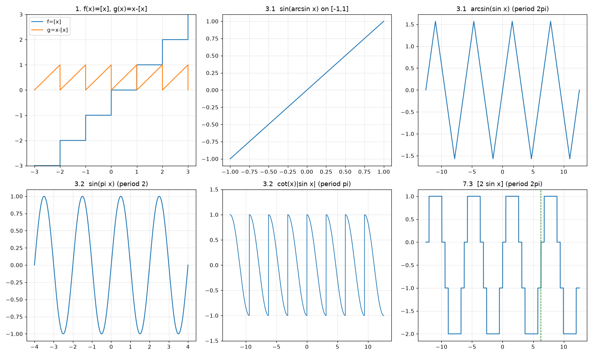

# Funkcje — rozwiązania (zestaw 02)

Zestaw zadań: [`problem-set-02.md`](problem-set-02.md) — zadania 1–8 (zadania na zajęcia 1–5, zadania domowe 6–8).

Skrypty sprawdzające: [`scripts/`](scripts/README.md) (`check_set02.py`, `plot_set02.py`). Nie są częścią rozwiązania.

**Konwencje**

- $[x]$ — największa liczba całkowita nie większa niż $x$.
- $\mathbb{N}=\{1,2,3,\dots\}$.
- $D_f$ — dziedzina, $R_f$ — zbiór wartości.

---

## Zadanie 1

Funkcje: $f(x)=[x]$, $g(x)=x-[x]$.

**Idea.** Dla $n\in\mathbb{Z}$ i $x\in[n,n+1)$ mamy $[x]=n$. Zatem $f$ jest stała na każdym przedziale $[n,n+1)$ i równa $n$ tam.

**Wykres $f$ (schodkowy).**

- Na $[n,n+1)$ wykres jest poziomym odcinkiem na wysokości $n$; punkt $(n,n)$ jest zamknięty (włączony), a $(n+1,n)$ jest otwarty.
- Kolejne schodki: $\dots,(-2,-2)$ na $[-2,-1)$, $(-1,-1)$ na $[-1,0)$, $0$ na $[0,1)$, $1$ na $[1,2)$, itd.
- Dla $x\to\infty$ wykres rośnie do $+\infty$, dla $x\to-\infty$ maleje do $-\infty$.

**Wykres $g$ (piła).**

- Dla $x\in[n,n+1)$ mamy $g(x)=x-n$, czyli odcinek rosnący z wartości $0$ (włączony) do wartości $1$ (wyłączony).
- Wartości $g$ leżą w przedziale $[0,1)$; $g$ jest okresowa z okresem $1$, bo $[x+1]=[x]+1$, więc $g(x+1)=x+1-[x]-1=g(x)$.
- Na każdym przedziale $[n,n+1)$ $g$ rośnie (nachylenie $1$), a w punktach $x=n$ przyjmuje wartość $0$ (skok w dół z $1$ do $0$).

**Uzasadnienie rachunkowe.** Warunek $[x]=n \iff n\le x\lt n+1$ pozwala sprawdzić każdy punkt wykresu. Na przykład $[2{,}7]=2$ i $g(2{,}7)=0{,}7$; $[-0{,}5]=-1$ i $g(-0{,}5)=0{,}5$.

---

## Zadanie 2

### 2.1. $\arccos\left(\sin\left(\dfrac{32}{5}\pi\right)\right)$

$$
\frac{32}{5}\pi=6\pi+\frac{2}{5}\pi,\qquad \sin\left(6\pi+\frac25\pi\right)=\sin\frac25\pi=\cos\left(\frac\pi2-\frac25\pi\right)=\cos\frac{\pi}{10}.
$$

Ponieważ $\dfrac{\pi}{10}\in[0,\pi]$, mamy $\arccos\left(\cos\dfrac{\pi}{10}\right)=\dfrac{\pi}{10}$.

**Wynik:** $\dfrac{\pi}{10}$.

### 2.2. $\arcsin\left(\cos\left(-\dfrac{7}{11}\pi\right)\right)$

$$
\cos\left(-\frac{7}{11}\pi\right)=\cos\frac{7}{11}\pi=\sin\left(\frac\pi2-\frac{7}{11}\pi\right)=\sin\left(-\frac{3}{22}\pi\right).
$$

Ponieważ $-\dfrac{3}{22}\pi\in\left[-\dfrac\pi2,\dfrac\pi2\right]$, mamy $\arcsin\left(\sin\left(-\dfrac{3}{22}\pi\right)\right)=-\dfrac{3}{22}\pi$.

**Wynik:** $-\dfrac{3\pi}{22}$.

---

## Zadanie 3

### 3.1. $f_1(x)=\sin(\arcsin x)$, $f_2(x)=\arcsin(\sin x)$

**$f_1$.** Dziedzina to $[-1,1]$, a na niej $\sin(\arcsin x)=x$. Funkcja nie jest okresowa: jej dziedzina jest ograniczona, a dla okresu $T\gt 0$ musiałoby być $x+T\in D_{f_1}$ dla każdego $x\in D_{f_1}$, co dla przedziału ograniczonego jest niemożliwe. Wykres to odcinek prosty $y=x$ na $[-1,1]$.

**$f_2$.** Dla $x\in\left[-\frac\pi2,\frac\pi2\right]$ mamy $f_2(x)=x$, a dla $x\in\left[\frac\pi2,\frac{3\pi}2\right]$ mamy $f_2(x)=\pi-x$. Stąd $f_2$ jest falą trójkątną o wartościach w $\left[-\frac\pi2,\frac\pi2\right]$, rosnącą na $\left[-\frac\pi2,\frac\pi2\right]$ i malejącą na $\left[\frac\pi2,\frac{3\pi}2\right]$.

- Okres: $f_2(x+2\pi)=\arcsin(\sin(x+2\pi))=f_2(x)$, więc $2\pi$ jest okresem.
- Okres podstawowy: zera $f_2$ to dokładnie $k\pi$, $k\in\mathbb{Z}$. Jeśli $T$ jest okresem, to $0=f_2(0)=f_2(T)$, więc $T=k\pi$. Dla $k$ nieparzystego $f_2(x+k\pi)=\arcsin(-\sin x)=-f_2(x)$, co dla $x=\frac\pi4$ daje $-\frac\pi4\neq\frac\pi4$. Zatem $k$ jest parzyste, a najmniejszy dodatni okres to $2\pi$.

**Wynik:** $f_1$ nie jest okresowa; $f_2$ jest okresowa, okres podstawowy $2\pi$.

### 3.2. $f_1(x)=\sin(\pi x)$, $f_2(x)=\operatorname{ctg}x\cdot|\sin x|$

**$f_1$.** $\sin(\pi(x+T))=\sin(\pi x)$ dla każdego $x$ wymaga $\pi T\in 2\pi\mathbb{Z}$, czyli $T\in2\mathbb{Z}$. Okres podstawowy to $2$.

**$f_2$.** Dziedzina: $\sin x\neq0$, czyli $x\notin\pi\mathbb{Z}$. Dla takich $x$:

$$
\operatorname{ctg}x\cdot|\sin x|=\frac{\cos x}{\sin x}\,|\sin x|=\cos x\cdot\operatorname{sgn}(\sin x).
$$

Zatem $f_2(x)=\cos x$ na $(0,\pi)$ oraz $f_2(x)=-\cos x$ na $(\pi,2\pi)$. Ponieważ $\cos(x+\pi)=-\cos x$ i $\operatorname{sgn}\sin(x+\pi)=-\operatorname{sgn}\sin x$, mamy

$$
f_2(x+\pi)=(-\cos x)(-\operatorname{sgn}\sin x)=f_2(x),
$$

więc $\pi$ jest okresem. Każdy okres $T$ musi spełniać: dziedzina $\mathbb{R}\setminus\pi\mathbb{Z}$ jest niezmiennicza względem przesunięcia o $T$, więc $T\in\pi\mathbb{Z}$. Dla $T=\pi$ wszystko działa, a więc okres podstawowy to $\pi$ (zob. też wykres: na każdym przedziale $(k\pi,(k+1)\pi)$ wykres jest kawałkiem $\pm\cos x$, a obydwa kawałki są takie same po przesunięciu o $\pi$).

**Wynik:** $f_1$ ma okres podstawowy $2$; $f_2$ ma okres podstawowy $\pi$.

---

## Zadanie 4

Parzystość: $f(-x)=f(x)$ dla każdego $x\in D_f$ (funkcja parzysta); nieparzystość: $f(-x)=-f(x)$.

### 4.1. $f(x)=x\cdot\left(2^x-2^{-x}\right)$

Dziedzina: $\mathbb{R}$, symetryczna względem zera.

$$
f(-x)=(-x)\left(2^{-x}-2^{x}\right)=x\left(2^{x}-2^{-x}\right)=f(x).
$$

**Wynik:** funkcja **parzysta**.

### 4.2. $f(x)=\log_2\left(x+\sqrt{x^2+1}\right)$

Dziedzina: $x+\sqrt{x^2+1}\gt 0$ dla każdego $x$, bo $\sqrt{x^2+1}\gt |x|\ge-x$. Zatem $D_f=\mathbb{R}$, symetryczna.

Iloczyn argumentów przy $x$ i $-x$:

$$
\left(x+\sqrt{x^2+1}\right)\left(-x+\sqrt{x^2+1}\right)=\left(x^2+1\right)-x^2=1.
$$

Stąd $-x+\sqrt{x^2+1}=\dfrac{1}{x+\sqrt{x^2+1}}$ i

$$
f(-x)=\log_2\frac{1}{x+\sqrt{x^2+1}}=-\log_2\left(x+\sqrt{x^2+1}\right)=-f(x).
$$

**Wynik:** funkcja **nieparzysta**.

---

## Zadanie 5

Ciąg jest monotoniczny, jeśli dla pewnego $n_0$ zachodzi $a_{n+1}\gt a_n$ dla wszystkich $n\ge n_0$ albo $a_{n+1}\lt a_n$ dla wszystkich $n\ge n_0$.

### 5.1. $a_n=n^2-8n+7$

Różnica kolejnych wyrazów:

$$
a_{n+1}-a_n=\big((n+1)^2-8(n+1)+7\big)-\big(n^2-8n+7\big)=2n-7.
$$

- Dla $n\le3$ różnica jest ujemna: $a_1\gt a_2\gt a_3\gt a_4$ (wartości $0,-5,-8,-9$).
- Dla $n\ge4$ różnica jest dodatnia: $a_4\lt a_5\lt a_6\lt \dots$.

Ciąg **nie jest monotoniczny** na całym $\mathbb{N}$ (maleje do $a_4$, potem rośnie). Jest jednak rosnący od $n_0=4$: dla każdego $n\ge4$ mamy $a_{n+1}\gt a_n$.

**Wynik:** nie jest monotoniczny; dla $n_0=4$ zachodzi $a_{n+1}\gt a_n$ dla $n\ge n_0$.

### 5.2. $a_n=-\dfrac{2}{n+3\arctan n}$

Niech $d_n=n+3\arctan n$. Dla $n\in\mathbb{N}$ mamy $\arctan n\ge\arctan1=\frac\pi4\gt 0$, więc $d_n\gt 0$ i ułamek ma sens.

Funkcja $d(t)=t+3\arctan t$ jest rosnąca (suma rosnących funkcji), więc $d_{n+1}\gt d_n\gt 0$. Funkcja $t\mapsto-\dfrac{2}{t}$ jest rosnąca na $(0,\infty)$ (dla $0\lt t_1\lt t_2$: $-\frac2{t_1}\lt -\frac2{t_2}$). Zatem

$$
a_{n+1}=-\frac{2}{d_{n+1}}\gt -\frac{2}{d_n}=a_n\qquad\text{dla każdego }n\ge1.
$$

**Wynik:** ciąg jest (ściśle) **rosnący** od $n_0=1$.

---

## Zadanie 6 (zadanie domowe)

### 6.1. $\arccos\left(\sin\dfrac{11}{7}\right)$

Ponieważ $\sin t=\cos\left(\frac\pi2-t\right)$:

$$
\sin\frac{11}{7}=\cos\left(\frac\pi2-\frac{11}{7}\right)=\cos\left(\frac{7\pi-22}{14}\right).
$$

Liczba $\dfrac{22-7\pi}{14}$ jest dodatnia (bo $7\pi\approx21{,}991\lt 22$), mała, i leży w $[0,\pi]$. Ponieważ $\cos$ jest parzysta, $\cos\dfrac{7\pi-22}{14}=\cos\dfrac{22-7\pi}{14}$, więc

$$
\arccos\left(\sin\frac{11}{7}\right)=\frac{22-7\pi}{14}\approx 0{,}000632.
$$

**Wynik:** $\dfrac{22-7\pi}{14}$.

### 6.2. $\arccos\left(\sin\dfrac{3}{5}\pi\right)$

$$
\sin\frac35\pi=\sin\left(\pi-\frac35\pi\right)=\sin\frac25\pi=\cos\left(\frac\pi2-\frac25\pi\right)=\cos\frac\pi{10}.
$$

Ponieważ $\dfrac{\pi}{10}\in[0,\pi]$:

**Wynik:** $\dfrac{\pi}{10}$.

### 6.3. $\arcsin\left(\cos\left(-\dfrac{5}{11}\right)\right)$

$\cos\left(-\frac5{11}\right)=\cos\frac5{11}=\sin\left(\frac\pi2-\frac5{11}\right)$, a $\dfrac{\pi}{2}-\dfrac{5}{11}=\dfrac{11\pi-10}{22}\approx1{,}12$ należy do $\left[-\frac\pi2,\frac\pi2\right]$ (bo $\frac\pi2\approx1{,}571$).

**Wynik:** $\dfrac{11\pi-10}{22}$.

### 6.4. $\arcsin\left(\cos\left(-\dfrac{3}{5}\pi\right)\right)$

$$
\cos\left(-\frac35\pi\right)=\cos\frac35\pi=\sin\left(\frac\pi2-\frac35\pi\right)=\sin\left(-\frac{\pi}{10}\right).
$$

Ponieważ $-\dfrac{\pi}{10}\in\left[-\dfrac\pi2,\dfrac\pi2\right]$:

**Wynik:** $-\dfrac{\pi}{10}$.

---

## Zadanie 7 (zadanie domowe)

### 7.1. $f_1(x)=\cos(\arccos x)$, $f_2(x)=\arccos(\cos x)$

**$f_1$.** Na $D=[-1,1]$ mamy $f_1(x)=x$. Dziedzina jest ograniczona, więc funkcja nie jest okresowa (argument jak w zadaniu 3.1).

**$f_2$.** Dla $x\in[0,\pi]$: $f_2(x)=x$; dla $x\in[\pi,2\pi]$: $f_2(x)=2\pi-x$. Jest to fala trójkątna o wartościach w $[0,\pi]$.

- Okres: $f_2(x+2\pi)=f_2(x)$, więc $2\pi$ jest okresem.
- Okres podstawowy: zera $f_2$ to dokładnie $2k\pi$. Każdy okres $T$ spełnia $f_2(T)=f_2(0)=0$, więc $T\in2\pi\mathbb{Z}$. Najmniejszy dodatni okres to $2\pi$. (Np. $\pi$ nie jest okresem: $f_2(\frac\pi4)=\frac\pi4$, a $f_2(\frac{5\pi}4)=\frac{3\pi}4$.)

**Wynik:** $f_1$ nie jest okresowa; $f_2$ ma okres podstawowy $2\pi$.

### 7.2. $f_1(x)=\cos\dfrac{x}{\pi}$, $f_2(x)=(\sin x+\cos x)^2$

**$f_1$.** $\cos\dfrac{x+T}{\pi}=\cos\dfrac{x}{\pi}$ dla każdego $x$ wymaga $\dfrac{T}{\pi}\in2\pi\mathbb{Z}$, czyli $T\in2\pi^2\mathbb{Z}$. Okres podstawowy: $2\pi^2$.

**$f_2$.** $(\sin x+\cos x)^2=\sin^2x+\cos^2x+2\sin x\cos x=1+\sin2x$. Funkcja $\sin 2x$ ma okres podstawowy $\pi$ (bo $\sin2(x+T)=\sin2x$ dla każdego $x$ wymaga $2T\in2\pi\mathbb{Z}$, czyli $T\in\pi\mathbb{Z}$). Zatem $f_2$ jest okresowa z okresem podstawowym $\pi$.

**Wynik:** $f_1$ ma okres podstawowy $2\pi^2$; $f_2$ ma okres podstawowy $\pi$.

### 7.3. $f(x)=[2\sin x]$

Wartości $2\sin x$ leżą w $[-2,2]$, więc $f$ przyjmuje wartości całkowite od $-2$ do $2$:

| $\sin x$ | $2\sin x$ | $f(x)$ |
|---|---|---|
| $[-1,-\tfrac12)$ | $[-2,-1)$ | $-2$ |
| $[-\tfrac12,0)$ | $[-1,0)$ | $-1$ |
| $[0,\tfrac12)$ | $[0,1)$ | $0$ |
| $[\tfrac12,1)$ | $[1,2)$ | $1$ |
| $1$ | $2$ | $2$ |

**Okres.** $f(x+2\pi)=f(x)$, bo $\sin$ ma okres $2\pi$. Okres podstawowy jest równy $2\pi$:

- Wartość $2$ przyjmowana jest tylko dla $\sin x=1$, czyli dla $x\in\frac\pi2+2\pi\mathbb{Z}$. Jeśli $T$ jest okresem, to $f(\frac\pi2+T)=2$, więc $\sin(\frac\pi2+T)=1$, czyli $T\in2\pi\mathbb{Z}$.
- Nie jest to $\pi$: $f(x+\pi)=[-2\sin x]$, a np. dla $x=\frac\pi6$ mamy $f(\frac\pi6)=[1]=1$, ale $f(\frac{7\pi}6)=[-1]=-1$.

**Wynik:** $f$ jest okresowa, okres podstawowy $2\pi$.

![Wykres [2 sin x]](scripts/plots_set02.png)

---

## Zadanie 8 (zadanie domowe)

### 8.1. $a_n=\log_2\left(2n+3^n\right)$

Wyrażenie $2n+3^n$ jest dodatnie i ściśle rosnące w $n$ (suma dwóch ściśle rosnących ciągów dodatnich). Ponieważ $\log_2$ jest rosnący, $a_n$ jest ściśle rosnący.

**Wynik:** ciąg **rosnący** dla $n_0=1$.

### 8.2. $a_n=\cos\dfrac{\pi n}{2}$

Wyrazy mają okres $4$:

$$
a_{4k+1}=0,\qquad a_{4k+2}=-1,\qquad a_{4k+3}=0,\qquad a_{4k+4}=1.
$$

Zatem $a_{n+1}-a_n$ dla $n=4k+1$ wynosi $-1\lt 0$ (spadek), a dla $n=4k+2$ wynosi $+1\gt 0$ (wzrost). W każdym ogonie $\{n\ge n_0\}$ występują oba typy różnic, więc dla żadnego $n_0$ ciąg nie jest monotoniczny od $n_0$.

**Wynik:** **nie jest monotoniczny** (dla żadnego $n_0$).

### 8.3. $a_n=\sin\dfrac{10\pi}{n+1}$

Oznaczmy $\theta_n=\dfrac{10\pi}{n+1}$. Wtedy $a_n=\sin\theta_n$, a $\theta_n$ maleje, gdy $n$ rośnie.

- Dla $n\ge19$ mamy $n+1\ge20$, więc $\theta_n\le\dfrac{10\pi}{20}=\dfrac\pi2$. Na przedziale $\left(0,\frac\pi2\right]$ funkcja $\sin$ jest ściśle rosnąca, więc $\theta_{n+1}\lt \theta_n\le\frac\pi2$ daje $a_{n+1}=\sin\theta_{n+1}\lt \sin\theta_n=a_n$. Zatem $a_{n+1}\lt a_n$ dla każdego $n\ge19$.
- Dla $n_0\le18$ ciąg nie jest od $n_0$ malejący: $a_{19}=\sin\frac\pi2=1\gt a_{18}=\sin\frac{10\pi}{19}\approx0{,}997$. Zatem warunek „malejący od $n_0$” wymaga $n_0\ge19$.
- Dla żadnego $n_0$ ciąg nie jest rosnący od $n_0$, bo dla $n\ge19$ jest malejący.

Dla przejrzystości: $a_{11}\approx0{,}5$, $a_{14}\approx0{,}866$, $a_{17}\approx0{,}985$, $a_{19}=1$, $a_{20}\approx0{,}9945$.

**Wynik:** ciąg jest **malejący** od $n_0=19$ (ściślej: $a_{n+1}\lt a_n$ dla $n\ge19$).

---

## Podsumowanie

| Zadanie | Wynik |
|---|---|
| 1 | $f=[x]$: schody; $g=x-[x]$: piła o wartościach w $[0,1)$, okres $1$ |
| 2.1 | $\dfrac{\pi}{10}$ |
| 2.2 | $-\dfrac{3\pi}{22}$ |
| 3.1 | $f_1$ nieokresowa; $f_2$ okres podstawowy $2\pi$ |
| 3.2 | $f_1$ okres podstawowy $2$; $f_2$ okres podstawowy $\pi$ |
| 4.1 | parzysta |
| 4.2 | nieparzysta |
| 5.1 | nie jest monotoniczny; rosnący dla $n\ge n_0=4$ |
| 5.2 | rosnący (dla $n\ge1$) |
| 6.1 | $\dfrac{22-7\pi}{14}$ |
| 6.2 | $\dfrac{\pi}{10}$ |
| 6.3 | $\dfrac{11\pi-10}{22}$ |
| 6.4 | $-\dfrac{\pi}{10}$ |
| 7.1 | $f_1$ nieokresowa; $f_2$ okres podstawowy $2\pi$ |
| 7.2 | $f_1$ okres podstawowy $2\pi^2$; $f_2$ okres podstawowy $\pi$ |
| 7.3 | okresowa, okres podstawowy $2\pi$ |
| 8.1 | rosnący dla $n_0=1$ |
| 8.2 | nie jest monotoniczny |
| 8.3 | malejący dla $n_0=19$ |
